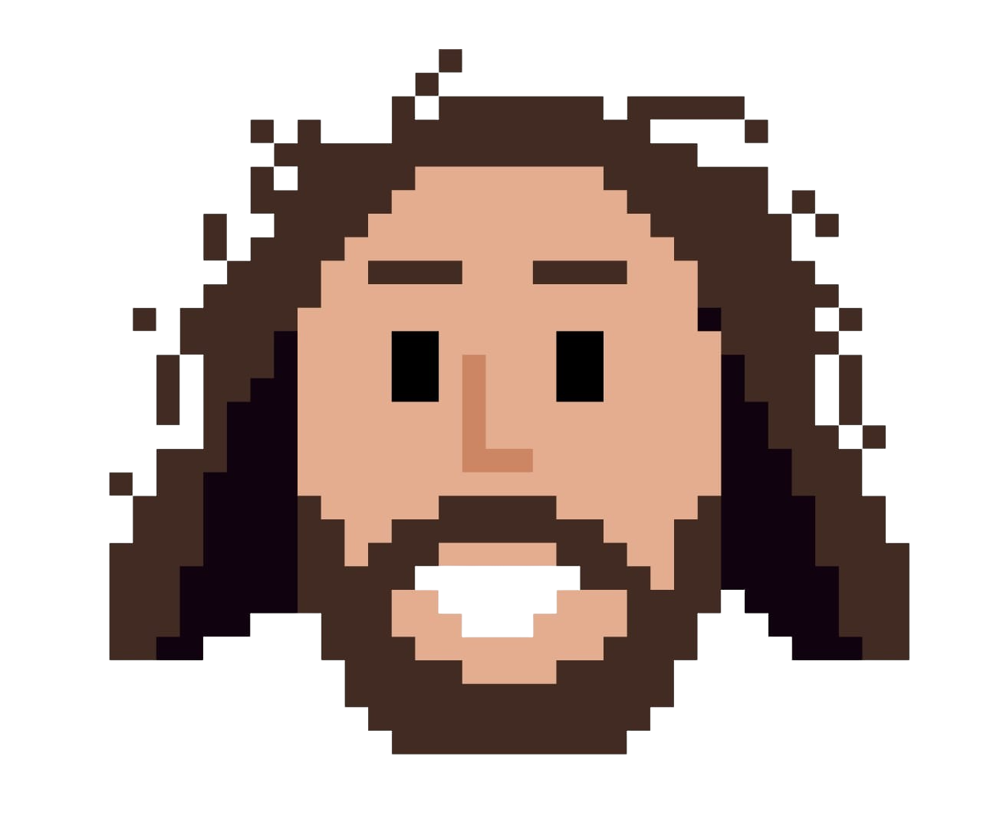
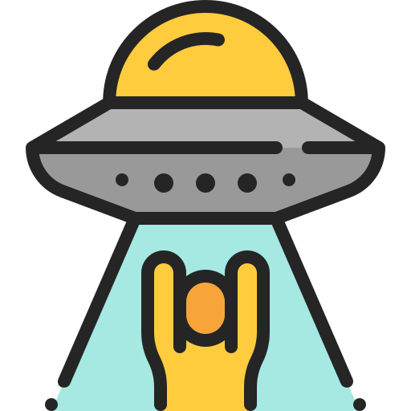
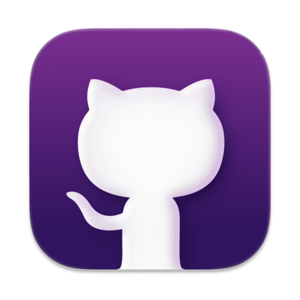
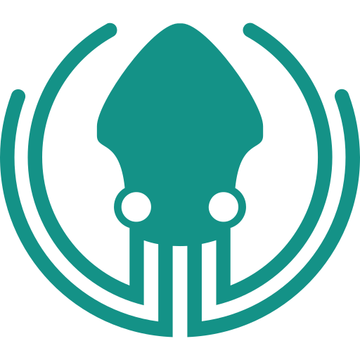

<!-- SECCIÓN TÍTULO -->
<section align="center">
  <!-- Nombre Felipe Agudelo -->
  

    
  

  <!-- Imagen Dresk76 -->
  

    
  

   
  <!-- Sobre mí typing -->
  <!-- Generador Typing SVG: https://readme-typing-svg.demolab.com/demo/ -->
  

    
     
  

   
  <!-- Iconos redes sociales: https://www.flaticon.com/icons -->
  

    
    &#8287;&#8287;&#8287;&#8287;&#8287;
    
    &#8287;&#8287;&#8287;&#8287;&#8287;
    
    &#8287;&#8287;&#8287;&#8287;&#8287;
    
  

    
  <!-- Contador de visitantes: https://visitorbadge.io -->
  <!-- Insignias sociales: https://shields.io -->
  

    
      
      
    
     
    
    
  

    
  <!-- Curriculum -->
  

    

      
    

     
    

      
    

     
    

      
    

  

</section>

<!-- Conoce un poco acerca de mi -->

  

    <h2>👨‍💻 Sobre mi</h2>
  

  <section>
     
    

      
    

     
    

      

        👋🏼 ¡Hola! Me llamo Felipe Agudelo 🧔, un estudiante de ingeniería informática 👨🏼‍🎓 de Colombia. Me especializo en el desarrollo de videojuegos en 2D 🕹️. Creo que los videojuegos son una forma poderosa de contar historias y entretener a las personas.
          
        🕰️ Dedico mi tiempo libre a la exploración y creación de nuevos conceptos y diseños de videojuegos 💻, siempre buscando aprender más y mejorar mis habilidades 🧠 para crear experiencias únicas e inolvidables 🚀.
          
        Como desarrollador de videojuegos en 2D, tengo habilidades sólidas en programación y en la nivelación de iluminación 🔆 y escenarios 🎭, así como en la implementación de efectos de sonido 🎛️ y en la selección de música ambiental 🎵. Me gusta trabajar en equipo 🤝 y colaborar con otros artistas y diseñadores para crear juegos distintivos y atractivos que cautiven al público 🌎.
          
        Además de mi pasión por el desarrollo de videojuegos 👨‍💻, también disfruto de la lectura 📖, ver películas 🎬 y escuchar música 🎧🤘. Estos pasatiempos me ayudan a tener una mente creativa e imaginativa 💡🤯, lo cual se refleja en mi trabajo en el desarrollo de videojuegos. En el futuro, me gustaría seguir creciendo como desarrollador de videojuegos y contribuir a la industria de los videojuegos 🏭🎮 con ideas innovadoras y creativas que marquen la diferencia.
          
        He creado un portafolio portafolio 💾💼 que consiste en un videojuego en 2D desarrollado con Unity 🎮, al que he llamado The Artifact Seeker 🧙🏻. Durante todo el proceso de diseño y desarrollo, he enfrentado múltiples desafíos 💪 que me han permitido aprender nuevas habilidades y poner a prueba mi creatividad 🔎🧠. Espero que este proyecto no solo demuestre mis habilidades en la programación y diseño de juegos, sino que también refleje mi pasión y dedicación ❤️‍🔥 en este campo de los videojuegos 🕹️.
          
        💬 Si deseas contactarme, puedes hacerlo a través de mis redes sociales 📱 o enviándome un correo electrónico.
        <a href="mailto:felipeagudeloolaya@gmail.com">
          felipeagudeloolaya@gmail.com 📫
        </a>
      

    

  </section>

<!-- The Artifact Seeker -->

  

    <h2>🧙🏻 ¡Explora mi portafolio relizado en Unity 2D!</h2>
  

  <section align="center">
     
    

      
    

     
    

      
    

     
    

      

        🎮 The Artifact Seeker es un juego de aventuras y exploración 🕯️ diseñado como un portafolio 📜, en el que los jugadores asumen el papel de un mago 🧙🏻 en busca de artefactos mágicos 🔮 en un misterioso castillo 🏰. El juego cuenta con gráficos 2D de estilo retro, que evocan sentimientos de nostalgia para aquellos que crecieron jugando videojuegos 🕹️ en la década de los 90's 🕰️💾. La música de fondo evocadora también ayuda a crear una atmósfera mágica y misteriosa que invita a la exploración 🎶.
      

      

        En el juego, el jugador debe interactuar con cuatro objetos diferentes 🛡️ que proporcionan información 📰 sobre el desarrollador en la vida real 🧔, como experiencias y estudios 👨🏼‍🎓. Esto permite una forma creativa de presentar la información personal del desarrollador de manera lúdica e interesante.
      

      

        El juego también cuenta con un emocionante enemigo final, un mago oscuro 🧙🏿 que los jugadores podrán derrotar y así completar su misión 🧩. Esta inclusión añade una capa adicional de emoción y tensión al juego 😲, y asegura que los jugadores tengan que superar una gran prueba final 🌌 para completar su aventura 🗝️.
      

      

        🧐 En general, The Artifact Seeker es una experiencia corta ⏳ pero interesante 🔥, que combina elementos de exploración 🔎, personalización 🎭 y combate ⚔️ en un paquete atractivo y único 👌.
      

    

  </section>

<!-- Herramientas favoritas -->

  

    <h2>💻 Mi stack tech</h2>
  

  <section align="center">
     
    

      
    

     
    <!-- Gif Gracioso: https://giphy.com/gifs/japan-jet-alt-BemKqR9RDK4V2 -->
    

      
    

      
    

      

        

          
        

         
        

          
          
          &#8287;&#8287;
          
          &#8287;&#8287;
          
          &#8287;&#8287;
          
          &#8287;&#8287;
          
          &#8287;&#8287;
          
          &#8287;
          
        

      

         
      

        

          
        

         
        

          
          &#8287;&#8287;
          
          &#8287;&#8287;
          
          &#8287;&#8287;
          
          &#8287;
          
          
        

      

    
  </section>

<!-- GitHub estadisticas y actividad -->

  

    <h2>📊 Mis estadisticas en GitHub</h2>
  

  <section align="center">
     
    

      
    

      
    <!-- GitHub Stats Card: https://github.com/anuraghazra/github-readme-stats -->
    

      

        
      

       
      

        
      

    

       
    <!-- GitHub Stats Card: https://github.com/anuraghazra/github-readme-stats -->
    

      

        
      

       
      

        
      

    

       
    <!-- GitHub Readme Streak Stats: https://github.com/DenverCoder1/github-readme-streak-stats -->
    

      

        
      

       
      

        
      

    

       
    <!-- Github Readme Activity Graph: https://github.com/ashutosh00710/github-readme-activity-graph -->
    

      

        
      

       
      

        
      

    

  </section>

<!-- Repositorios -->

  

    <h2>📂 Mis proyectos</h2>
  

  <section align="center">
     
    

      
    

      
    

      
      
      
      
      
      
    

      
    

        
    

  </section>

